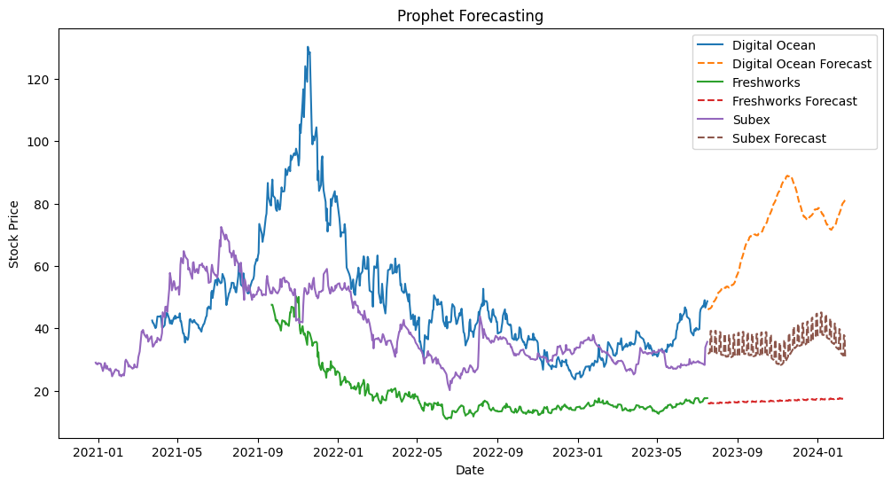

# [Project 1: Stock Price Prediction](https://github.com/Pyken10/Stock-Prediction)  

* **Data Preprocessing**: Ensured data quality for Digital Ocean, Freshworks, and Subex with thorough cleaning using Pandas.
* **Statistical Analysis**: Leveraged key metrics to understand stock dynamics, supported by Numpy for numerical computations.
* **Volatility and Risk Assessment**: Conducted volatility analysis with average daily returns and annualized volatility, using Pandas for data management.
* **Trend Identification**: Identified market trends through advanced data analysis techniques.
* **Predictive Modeling**: Employed the Prophet forecasting model for accurate future stock price predictions, enhancing investment decision-making.
* **Visual Insights**: Offered visual comparisons of predicted vs. actual prices with Matplotlib, validating the accuracy of the Prophet model.
* **Strategic Insights**: Delivered actionable insights for informed investments in the tech stock market, utilizing advanced predictive analytics.
* **Data-Driven Strategies**: Demonstrated the integration of data science with financial analysis, using Pandas, Numpy, Matplotlib, and the Prophet forecasting model for strategic stock trading insights.

## Prophet forecasting model used in stock prediction

# [Project 2: Blast Freezer Truck Schedule Optimization for Supply Chain Efficiency](https://github.com/Pyken10/Blast-Freezer-Truck-Schedule-Optimization-for-Supply-Chain-Efficiency)

* **Strategic Scheduling Model Development**: Developed a model for optimizing Interchange Group Inc.'s blast freezer truck schedules, balancing capacity and operational costs.
* **Monte Carlo Simulations**: Utilized Monte Carlo simulations to model freezer capacity usage, informing scheduling decisions.
* **Data-Driven Decision Making**: Analyzed historical shipment data to optimize truck scheduling, achieving an ideal balance between demand and resource utilization.
* **Operational Efficiency Enhancement**: Determined the optimal scheduling of 25-30 trucks weekly, enhancing resource efficiency and minimizing costs.
* **Analytics in Operational Efficiency**: Showcased the effective use of analytics, particularly Monte Carlo simulations and data analysis, for logistics optimization in the food supply chain sector.
* **Tools for Analytics and Visualization**: Employed Pandas, Numpy, and Matplotlib to support data analysis and visualization efforts in the project.

# [Project 3: Digital Marketing Project for Uncommon VCU Website](https://github.com/Pyken10/Digital-Marketing-Project-for-Uncommonvcu)

* **Website Development & UX Optimization**: Crafted a responsive Uncommonvcu website with WordPress, ensuring user-friendly navigation and peak performance.
* **SEO Best Practices Implementation**: Applied SEO techniques such as alt text and image optimization, enhancing search rankings and user accessibility.
* **Performance Metrics Analysis**: Leveraged Bing Places and Google Search Console to analyze and boost website metrics, focusing on local SEO.
* **Elementor-WordPress Integration**: Solved Elementor compatibility issues, upholding consistent design and functionality across the platform.
* **Digital Marketing Success**: Formulated strategies yielding a 20% boost in user engagement through improved search engine click-through rates.

# [Project 4: Football Player Management System](https://github.com/Pyken10/Football-Player-Management-System/tree/main) 

* **Technologies Used**: Python for backend development; SQL for database management; 
* **Project Description**: Engineered a robust platform for managing football players’ profiles, streamlining processes such as data entry, updates, and player performance tracking.
* **Key Features and Responsibilities**:
⋅⋅* Developed player registration and management modules, enabling dynamic data handling and user interaction.
⋅⋅* Designed a relational database schema to reliably store and manage player and match data.
⋅⋅* Built an intuitive user interface that simplifies navigation and data manipulation for non-technical users.
* **Achievements/Findings**:
⋅⋅* Improved data retrieval efficiency, enhancing decision-making for player selection and team strategy.
⋅⋅* Provided analytical insights from player data, influencing team composition and tactical approaches.
* **Skills Highlight**:
⋅⋅* Database Design: Structured SQL databases for scalability and performance.
⋅⋅* SQL Querying: Crafted complex queries for data analysis and reporting.
⋅⋅* UI Design: Developed a clean, responsive user interface focused on usability.
⋅⋅* Python Programming: Implemented backend logic and database integration.
⋅⋅* Problem Solving: Addressed and resolved system design and user experience challenges.
⋅⋅* Project Management: Coordinated development phases and met project milestones.

